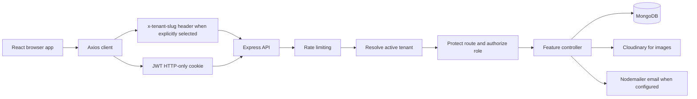

# PetServiceHub Current System Architecture

## 1. System Overview

PetServiceHub is a multi-tenant pet-care platform for pet owners, veterinary providers, and administrators.

The current system provides:

- Local authentication with email verification.
- Google OAuth authentication.
- Tenant-aware data isolation.
- Pet profiles and vaccination records.
- Vaccination reminders and notifications.
- Veterinary clinic discovery and map markers.
- Nearby clinic search and directions.
- Appointment booking and provider status management.
- Verified reviews tied to completed appointments.
- Community posts, images, editing, likes, and replies.
- User and provider-specific notifications.
- Cloudinary image uploads.

### Main technologies

| Layer | Technology |
| --- | --- |
| Frontend | React 19, Vite, React Router, Axios, Tailwind CSS |
| Maps | Leaflet, react-leaflet, OpenStreetMap, OSRM directions |
| Backend | Node.js, Express |
| Database | MongoDB with Mongoose |
| Authentication | JWT HTTP-only cookie, bcrypt, Passport Google OAuth |
| Images | Multer memory storage and Cloudinary |
| Email | Nodemailer with Gmail SMTP |
| Icons | Lucide React |

### Main entry points

- Backend: `backend/src/server.js`
- Frontend: `frontend/src/main.jsx`
- Frontend routes: `frontend/src/app/routes.jsx`
- Axios client: `frontend/src/lib/axios.js`

## 2. High-Level Request Flow



Every API request is processed through the global API rate limiter and tenant resolver. Protected routes additionally load the current user from the JWT cookie and verify tenant membership.

## 3. Backend Startup and Middleware

Backend entry: `backend/src/server.js`

Startup sequence:

1. Load environment variables.
2. Create the Express app.
3. Enable cookie parsing.
4. Initialize Passport.
5. Enable CORS for `http://localhost:5173`.
6. Parse JSON request bodies.
7. Apply the API rate limiter.
8. Resolve the active tenant.
9. Mount feature routers.
10. Connect to MongoDB.
11. Create the default tenant if it does not exist.
12. Migrate legacy records without a tenant ID.
13. Run the initial vaccination notification sweep.
14. Schedule another vaccination sweep every 24 hours.
15. Start the HTTP server.

### Global middleware

#### Tenant resolution

File: `backend/src/middleware/tenantContext.js`

Tenant resolution order:

1. Explicit `x-tenant-slug` request header.
2. Tenant ID from a valid JWT when no explicit header exists.
3. Subdomain when `TENANT_BASE_DOMAIN` is configured.
4. `DEFAULT_TENANT_SLUG`, defaulting to `default`.

The tenant must exist and be active.

If a user was reassigned to another tenant in MongoDB while an old JWT still exists, protected requests refresh the tenant context from the current user record unless the user explicitly selected a mismatched workspace.

#### Authentication

File: `backend/src/middleware/protectRoute.js`

The middleware:

- Reads the JWT from the `jwt` cookie or an Authorization Bearer header.
- Verifies the token with `JWT_SECRET`.
- Loads the current user from MongoDB.
- Removes the password field from the loaded user.
- Requires the user to have a tenant ID.
- Rejects explicitly selected tenants that do not match the user.
- Adds `req.user`, `req.tenant`, and `req.tenantId`.

#### Role authorization

File: `backend/src/middleware/authorizeRoles.js`

Supported roles:

- `user`
- `provider`
- `admin`

Provider routes require the `provider` role. Tenant creation requires the `admin` role.

#### Rate limiting

File: `backend/src/middleware/rateLimiters.js`

- General API limit: 300 requests per 15 minutes.
- Authentication limit: 10 failed attempts per 15 minutes.
- Successful authentication requests are skipped by the authentication limiter.

## 4. Authentication Workflow

Files:

- `backend/src/controllers/auth.controller.js`
- `backend/src/routes/auth.routes.js`
- `frontend/src/features/Auth/context/AuthProvider.jsx`
- `frontend/src/features/Auth/pages/AuthPage.jsx`

### Signup

1. User submits name, email, and password.
2. Frontend sends `POST /api/auth/signup`.
3. Backend resolves the current tenant.
4. Backend validates the fields.
5. Password is hashed with bcrypt.
6. User is created with the current tenant ID.
7. A verification token is generated for 24 hours.
8. Verification email is sent.
9. User must verify before normal login.

### Login

1. User submits email and password.
2. Backend searches the resolved tenant first.
3. If no match is found, the backend can locate the user by email and use the user's assigned tenant.
4. Password and email verification are checked.
5. A JWT cookie is issued for seven days.
6. The response includes user identity and tenant metadata.
7. Frontend stores the returned tenant slug as `pawcareTenant`.
8. TenantProvider updates the visible workspace label.

### Current user bootstrap

`GET /api/auth/me` returns the current user and assigned tenant metadata. This allows the frontend to recover correctly even when the user was manually assigned to a new tenant in the database.

### Google OAuth

Routes:

- `GET /api/auth/google`
- `GET /api/auth/google/callback`

Google users are assigned a tenant by the Passport configuration and receive the same JWT cookie flow.

## 5. Tenant Architecture

Files:

- `backend/src/models/Tenant.js`
- `backend/src/middleware/tenantContext.js`
- `backend/src/controllers/tenant.controller.js`
- `frontend/src/app/providers/TenantProvider.jsx`
- `frontend/src/components/layout/Navbar.jsx`

### Tenant model

Tenant fields:

- `name`
- `slug`
- `active`
- timestamps

The slug is lowercase, unique, and restricted to letters, numbers, and hyphens.

### Tenant ownership

The following records contain a `tenantId`:

- Users
- Profiles
- Clinics
- Pets
- Appointments
- Reviews
- Notifications
- Community posts
- Comments

### Tenant creation

Endpoint:

```text
POST /api/tenants
```

Requirements:

- Authentication required.
- Admin role required.
- Name and lowercase slug required.

There is currently no frontend tenant administration page.

### Frontend workspace behavior

The frontend:

- Stores the current tenant slug in local storage as `pawcareTenant`.
- Uses `VITE_TENANT_SLUG` as an optional fallback.
- Does not send the default slug header unnecessarily.
- Displays the current slug in the desktop profile panel and mobile menu.
- Allows manual workspace changes through the Navbar prompt.
- Reloads after a manual workspace change.
- Synchronizes automatically from authenticated user tenant metadata.

Current tenant membership model: one user has one `tenantId`. There is no multi-tenant membership table yet.

## 6. Complete Backend API Reference

### Health

| Method | Endpoint | Auth | Purpose |
| --- | --- | --- | --- |
| GET | `/api/health` | Public | Backend health check |

### Authentication

| Method | Endpoint | Auth | Purpose |
| --- | --- | --- | --- |
| POST | `/api/auth/signup` | Public | Register a user in the resolved tenant |
| POST | `/api/auth/login` | Public | Authenticate and set JWT cookie |
| POST | `/api/auth/logout` | Public | Clear JWT cookie |
| GET | `/api/auth/me` | Protected | Return current user and tenant |
| GET | `/api/auth/verify-email/:token` | Public | Verify email address |
| GET | `/api/auth/google` | Public | Start Google OAuth |
| GET | `/api/auth/google/callback` | OAuth callback | Complete Google OAuth |

### Profiles

| Method | Endpoint | Auth | Purpose |
| --- | --- | --- | --- |
| GET | `/api/profile` | Protected | Load current profile |
| PUT | `/api/profile` | Protected | Update profile |

Profile data includes phone, avatar, bio, address, city, state, and postal code.

### Tenants

| Method | Endpoint | Auth | Purpose |
| --- | --- | --- | --- |
| POST | `/api/tenants` | Admin | Create a tenant |

### Clinics

| Method | Endpoint | Auth | Purpose |
| --- | --- | --- | --- |
| GET | `/api/clinics` | Public | List clinics in the active tenant |
| GET | `/api/clinics/:clinicId` | Public | Get clinic details |
| GET | `/api/clinics/nearby` | Public | Search clinics by location |
| GET | `/api/clinics/mine` | Provider | List owned clinics |
| POST | `/api/clinics` | Provider | Create clinic |
| PATCH | `/api/clinics/:clinicId` | Provider owner | Update clinic |
| DELETE | `/api/clinics/:clinicId` | Provider owner | Delete clinic |

Clinic fields include:

- Name and description
- Phone, email, and website
- Address, city, state, postal code
- Image URL
- Specialties and services
- GeoJSON location
- Rating and review count
- Owner provider

Nearby search accepts longitude, latitude, max distance, result limit, city, and specialty. Maximum distance is clamped to 100 meters through 100 kilometers. Clinic coordinates are stored as `[longitude, latitude]` and converted to Leaflet `[latitude, longitude]` in the frontend.

### Appointments

| Method | Endpoint | Auth | Purpose |
| --- | --- | --- | --- |
| GET | `/api/appointments` | User | List the current user's appointments |
| POST | `/api/appointments` | User | Book a clinic appointment |
| GET | `/api/appointments/:appointmentId` | User | View one owned appointment |
| PATCH | `/api/appointments/:appointmentId/cancel` | User | Cancel an eligible appointment |
| GET | `/api/appointments/provider` | Provider | List appointments for owned clinics |
| PATCH | `/api/appointments/provider/:appointmentId/status` | Provider owner | Change appointment status |

Appointment statuses:

- `pending`
- `confirmed`
- `completed`
- `cancelled`

Booking validation verifies that the pet belongs to the user and the clinic belongs to the active tenant. Provider appointment access is restricted to clinics owned by the provider.

### Pets

| Method | Endpoint | Auth | Purpose |
| --- | --- | --- | --- |
| GET | `/api/pets` | User | List owned pets |
| POST | `/api/pets` | User | Create a pet |
| GET | `/api/pets/:petId` | Owner | Get pet details |
| PATCH | `/api/pets/:petId` | Owner | Update pet |
| DELETE | `/api/pets/:petId` | Owner | Delete pet |

Pet fields include name, species, breed, gender, date of birth, weight, image, medical notes, and embedded vaccinations.

### Vaccinations

| Method | Endpoint | Auth | Purpose |
| --- | --- | --- | --- |
| GET | `/api/pets/:petId/vaccinations` | Pet owner | List vaccination records |
| POST | `/api/pets/:petId/vaccinations` | Pet owner | Add a vaccination |
| PATCH | `/api/pets/:petId/vaccinations/:vaccinationId` | Pet owner | Update a vaccination |
| DELETE | `/api/pets/:petId/vaccinations/:vaccinationId` | Pet owner | Delete a vaccination |

Vaccination fields:

- Vaccine name
- Date administered
- Next due date
- Dose number
- Total doses
- Recurrence interval in months
- Veterinarian
- Notes
- Certificate image URL
- Linked clinic
- Derived provider reference

When a clinic is selected, the backend validates the clinic and derives its owner as the vaccination provider. When recurrence is configured without a next due date, the backend calculates the first due date from the administration date.

### Reminders

| Method | Endpoint | Auth | Purpose |
| --- | --- | --- | --- |
| GET | `/api/reminders` | User | Return due vaccination reminders |

Response structure:

```json
{
  "reminders": [],
  "windowDays": 30
}
```

Reminder statuses:

- `overdue`
- `dueToday`
- `dueSoon`

The reminder window is controlled by `VACCINATION_REMINDER_DAYS`, clamped between 1 and 365 days.

### Notifications

| Method | Endpoint | Auth | Purpose |
| --- | --- | --- | --- |
| GET | `/api/notifications` | Protected | List recipient notifications and unread count |
| PATCH | `/api/notifications/:notificationId/read` | Recipient | Mark one notification read |
| PATCH | `/api/notifications/read-all` | Protected | Mark all recipient notifications read |

Notifications are filtered by both `tenantId` and recipient user ID.

Notification types currently include:

- `appointment_created`
- `appointment_confirmed`
- `appointment_cancelled`
- `appointment_completed`
- `review_due`
- `review_created`
- `review_updated`
- `vaccination_due`

Notification delivery:

- In-app Navbar notification panel.
- Unread count.
- 60-second frontend polling.
- Optional SMTP email when `EMAIL_USER` and `EMAIL_PASSWORD` are configured.

### Reviews

| Method | Endpoint | Auth | Purpose |
| --- | --- | --- | --- |
| GET | `/api/reviews/clinic/:clinicId` | Public | List clinic reviews |
| GET | `/api/reviews/mine` | User | List current user's reviews |
| POST | `/api/reviews` | User | Create review for completed appointment |
| PATCH | `/api/reviews/:reviewId` | Review owner | Update review |
| DELETE | `/api/reviews/:reviewId` | Review owner | Delete review |

Rules:

- Appointment must belong to the user.
- Appointment must have `completed` status.
- One review is allowed per appointment.
- Rating must be an integer from 1 through 5.
- Clinic rating and review count are recalculated after changes.
- Clinic providers receive review notifications.

### Community

| Method | Endpoint | Auth | Purpose |
| --- | --- | --- | --- |
| GET | `/api/community/posts` | Public | List up to 50 posts |
| GET | `/api/community/posts/:postId` | Public | Get one post |
| GET | `/api/community/posts/:postId/comments` | Public | List replies |
| POST | `/api/community/posts` | Protected | Create post |
| PATCH | `/api/community/posts/:postId` | Author | Edit post |
| PATCH | `/api/community/posts/:postId/like` | Protected | Toggle like |
| DELETE | `/api/community/posts/:postId` | Author | Delete post and replies |
| POST | `/api/community/posts/:postId/comments` | Protected | Add reply |
| DELETE | `/api/community/comments/:commentId` | Author/post owner | Delete reply |

Post features:

- Title and content.
- Categories: general, health, behavior, nutrition, grooming, advice.
- Optional image URL.
- Author-only edit and delete.
- Per-user likes stored in `likedBy`.
- Tenant-scoped comments.
- Post owner can delete replies on their post.

### Uploads

| Method | Endpoint | Auth | Multipart field | Purpose |
| --- | --- | --- | --- | --- |
| POST | `/api/upload` | Protected | `image` | Upload image to Cloudinary |

The upload response contains `imageUrl` and `ownerId`.

Used for:

- Profile avatars
- Pet images
- Clinic images
- Community post images
- Vaccination certificate images

The current upload endpoint is image-oriented. PDF certificate uploads are not currently supported.

## 7. Data Model Reference

### User

File: `backend/src/models/User.js`

- Name
- Email
- Password for local accounts
- Tenant ID
- Role
- Email verification state
- Google OAuth ID/provider
- Timestamps

### Tenant

File: `backend/src/models/Tenant.js`

- Name
- Unique slug
- Active flag
- Timestamps

### Profile

File: `backend/src/models/Profile.js`

- User and tenant references
- Phone
- Avatar
- Bio
- Address
- City
- State
- Postal code

### Clinic

File: `backend/src/models/Clinic.js`

- Provider owner
- Tenant ID
- Contact and address fields
- GeoJSON location
- Image
- Specialties and services
- Rating and review count

Indexes include owner, city, and a `2dsphere` location index.

### Pet

File: `backend/src/models/Pet.js`

- Owner
- Tenant ID
- Basic pet profile
- Image
- Flexible medical information
- Embedded vaccination array

### Vaccination subdocument

- Vaccine name
- Date administered
- Next due date
- Dose progression
- Recurrence interval
- Veterinarian
- Notes
- Certificate URL
- Clinic reference
- Provider reference
- Timestamps

### Appointment

- User
- Pet
- Clinic
- Service
- Date and time
- Notes
- Status
- Tenant ID
- Timestamps

### Review

- User
- Appointment
- Clinic
- Rating
- Comment
- Tenant ID
- Timestamps

### Post

- Tenant ID
- Author
- Title
- Content
- Optional image
- Category
- Liked user IDs
- Timestamps

### Comment

- Tenant ID
- Post
- Author
- Content
- Timestamps

### Notification

- Tenant ID
- Recipient
- Type
- Title
- Message
- Link
- Reference ID
- Unique key
- Read timestamp
- Timestamps

Notification uniqueness is enforced by tenant and unique key.

## 8. Frontend Routes and Pages

### Public routes

| Route | Page | Purpose |
| --- | --- | --- |
| `/` | Home | Landing and discovery content |
| `/login` | AuthPage | Login |
| `/signup` | AuthPage | Signup |
| `/find-vets` | FindVetsPage | Clinic search and map |
| `/find-vets/:clinicId` | ClinicDetailsPage | Clinic detail, reviews, and directions |
| `/about` | AboutPage | About content |
| `/contact` | ContactPage | Contact information |
| `/services` | ServicesPage | Service information |
| `/community` | CommunityPage | Public community feed |

### Protected user routes

| Route | Page | Purpose |
| --- | --- | --- |
| `/profile` | ProfilePage | User profile |
| `/pets` | PetsPage | Pet list and pet form |
| `/pets/:petId` | PetDetailsPage | Pet details, medical notes, vaccination history |
| `/reminders` | RemindersPage | Dedicated vaccination reminders |
| `/appointments` | AppointmentsPage | User appointments and reviews |
| `/appointments/new/:clinicId` | BookingPage | Create appointment |
| `/appointments/:appointmentId/confirmation` | BookingConfirmationPage | Booking result/details |

### Provider routes

| Route | Page | Purpose |
| --- | --- | --- |
| `/provider/dashboard` | ProviderDashboard | Provider overview |
| `/provider/clinics` | ProviderClinicsPage | Clinic CRUD and image management |
| `/provider/appointments` | ProviderAppointmentsPage | Provider appointment management |

Provider routes are protected by `ProviderRoute`. Admins do not currently have a dedicated frontend dashboard.

## 9. Frontend Workflows

### Clinic discovery

1. User opens Find a vet.
2. Frontend calls `GET /api/clinics`.
3. Clinic cards and map markers are displayed.
4. Map fits all clinic coordinates.
5. Selecting a clinic card zooms to that marker.
6. User can search by clinic, specialty, or city.
7. User can request browser location.
8. Nearby search uses radius and specialty filters.
9. Clinic details provide reviews, directions, and booking entry.

### Provider clinic management

1. Provider opens provider clinics.
2. Existing owned clinics load from `/api/clinics/mine`.
3. Provider enters clinic details.
4. Provider selects a location on Leaflet or enters coordinates.
5. Provider optionally uploads a clinic image.
6. Create/update sends clinic data and GeoJSON location.
7. After save, owned clinics reload.
8. Public clinic list includes the new clinic and map viewport fits it.

### Appointment booking

1. User opens a clinic detail page.
2. User selects a pet, service, date, time, and notes.
3. Backend validates pet ownership and clinic tenant membership.
4. Appointment is created with `pending` status.
5. Provider receives a new appointment request notification.
6. Provider sees the appointment in the provider dashboard.
7. Provider changes status to confirmed, completed, or cancelled.
8. User receives status notifications.
9. A completed appointment creates a review opportunity.

### Pet management

1. User creates or edits a pet profile.
2. User can upload a pet image.
3. User stores plain medical notes rather than entering raw JSON.
4. Pet details show profile, medical information, and vaccination history.

### Vaccination management

1. User opens a pet detail page.
2. User adds vaccine name and administration date.
3. User can set next due date, dose progression, recurrence, notes, veterinarian, certificate image, and clinic.
4. The backend validates the selected clinic and derives its provider.
5. Pet details display the vaccination history and reminder status.
6. The dedicated reminders page aggregates upcoming and overdue records.
7. The backend notification sweep creates in-app vaccination notifications.
8. Recurring vaccinations advance to the next due date after becoming overdue.

### Community feed

1. Guests can read posts and replies.
2. Authenticated users can create a post.
3. User enters title, content, and category.
4. User may upload an image with a 5 MB client-side limit.
5. Post is stored with the Cloudinary image URL.
6. Author can edit or delete their post.
7. Users can like or unlike posts.
8. Users can open replies and add comments.
9. Comment authors and post owners can delete permitted replies.
10. Deleting a post also removes its replies.

### Notification workflow

1. Backend event creates a tenant-scoped notification.
2. Recipient is selected based on event ownership.
3. Notification is stored with a unique key.
4. Optional email is attempted when SMTP is configured.
5. Frontend Navbar polls every 60 seconds.
6. User sees unread count and notification list.
7. Clicking a notification marks it read and navigates to its link.

## 10. Frontend Navigation by Role

### Guest

- Home
- Services
- Community
- Find a vet
- About
- Contact

### Authenticated user

- Home
- Community
- Find a vet
- My Pets
- Appointments
- Reminders
- About
- Contact

### Provider

- Provider Home
- Appointments
- Clinics
- My Profile
- About
- Contact

Providers intentionally do not see the user-facing Find a vet and Services links in their main navigation.

## 11. Environment Configuration

Backend `.env`:

```env
PORT=5000
MONGO_URI=mongodb://127.0.0.1:27017/pawcare
JWT_SECRET=replace_with_a_long_random_secret
DEFAULT_TENANT_SLUG=default
TENANT_BASE_DOMAIN=example.com
GOOGLE_CLIENT_ID=your_google_client_id
GOOGLE_CLIENT_SECRET=your_google_client_secret
EMAIL_USER=your_smtp_email
EMAIL_PASSWORD=your_smtp_password_or_app_password
VACCINATION_REMINDER_DAYS=30
CLOUDINARY_CLOUD_NAME=your_cloudinary_cloud_name
CLOUDINARY_API_KEY=your_cloudinary_api_key
CLOUDINARY_API_SECRET=your_cloudinary_api_secret
```

Frontend `.env`:

```env
VITE_TENANT_SLUG=default
```

Development URLs:

- Frontend: `http://localhost:5173`
- Backend: `http://localhost:5000`
- Health check: `http://localhost:5000/api/health`

## 12. Running the System

Install backend dependencies:

```bash
cd backend
npm install
```

Install frontend dependencies:

```bash
cd frontend
npm install
```

Start backend:

```bash
cd backend
npm run dev
```

Start frontend:

```bash
cd frontend
npm run dev
```

Production frontend build:

```bash
cd frontend
npm run build
```

Other scripts:

```bash
cd backend
npm start
npm run seed:clinics
```

## 13. Security and Data Isolation

Current controls:

- HTTP-only JWT cookie.
- Password hashing with bcrypt.
- Email verification for local accounts.
- Tenant ID included on tenant-owned records.
- Tenant filtering in controller queries.
- Provider ownership checks for clinics and appointments.
- Pet ownership checks for pets and vaccinations.
- Review ownership and completed-appointment checks.
- Community author checks for editing and deletion.
- Recipient checks when reading or marking notifications.
- Rate limiting for general and authentication APIs.

## 14. Current Limitations and Risks

### Product limitations

- One tenant per user; no membership table for multiple workspaces.
- No tenant administration UI.
- No admin frontend dashboard.
- No SMS or push notification provider integration.
- Email notifications require SMTP credentials.
- Certificate upload is currently image-based; PDF upload is not supported.
- No vaccine document metadata beyond the stored image URL.
- No provider availability, working hours, slot locking, or overlap detection for appointments.
- No recurring appointment scheduling; recurring support currently applies to vaccination due dates.
- No AI symptom checker backend.
- Contact page has no backend submission workflow.
- Several home page sections still use mock/static data.

### Operational risks

- API base URL is currently hard-coded to `http://localhost:5000` in the frontend Axios client.
- JWT cookies use `secure: false`, which must be changed for production HTTPS.
- Google OAuth callback URLs are localhost-specific.
- Upload validation is mainly client-side; Multer does not currently enforce a server-side file-size or MIME policy.
- OSRM and OpenStreetMap are external service dependencies.
- Email failures are logged and do not fail the originating API request.
- The vaccination sweep runs on startup and every 24 hours; a production deployment should use a durable job scheduler for stronger delivery guarantees.
- Tenant migration runs automatically on startup and mutates legacy records.
- Login fallback by email across tenants should be reviewed if the same email can exist in multiple tenants.

## 15. Primary File Map

### Backend

- `backend/src/server.js`
- `backend/src/config/db.js`
- `backend/src/config/cloudinary.js`
- `backend/src/config/passport.js`
- `backend/src/controllers/`
- `backend/src/middleware/`
- `backend/src/models/`
- `backend/src/routes/`
- `backend/src/services/notification.service.js`
- `backend/src/services/tenantMigration.service.js`
- `backend/src/uploads/upload.js`
- `backend/src/utils/`

### Frontend

- `frontend/src/main.jsx`
- `frontend/src/app/App.jsx`
- `frontend/src/app/routes.jsx`
- `frontend/src/app/providers/`
- `frontend/src/components/layout/`
- `frontend/src/components/routing/`
- `frontend/src/features/Auth/`
- `frontend/src/features/Appointments/`
- `frontend/src/features/Clinics/`
- `frontend/src/features/Community/`
- `frontend/src/features/Pets/`
- `frontend/src/features/Profile/`
- `frontend/src/features/Notifications/`
- `frontend/src/lib/axios.js`
- `frontend/src/lib/uploadApi.js`

## 16. Recommended Next Improvements

1. Add a tenant membership model and tenant switcher based on allowed memberships.
2. Add an admin tenant and user management interface.
3. Move API base URL and OAuth callback URLs to environment variables.
4. Add server-side upload size, MIME, and image dimension validation.
5. Add appointment availability and conflict prevention.
6. Add a durable background job system for reminders and email delivery.
7. Add PDF certificate support with secure file validation.
8. Add SMS and push delivery through configured providers.
9. Add integration tests for tenant isolation and provider notification routing.
10. Replace remaining home page mock data with API-backed data.
